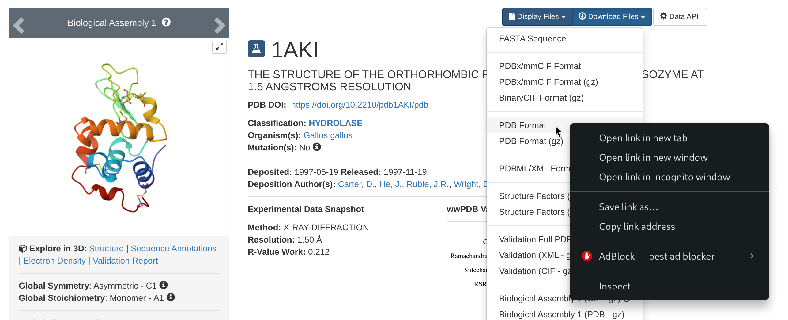

# GROMACS and Baobab hands-on introduction
This being said, it is worth pointing out a couple of commands that you might need to begin the tutorial. The first is [`wget`](https://ftp.gnu.org/old-gnu/Manuals/wget-1.8.1/html_mono/wget.html), and you will need it to download files from a web address. At the beginning of the tutorial, you will be asked to go to the [RCSB](https://www.rcsb.org/) website and download the protein data bank file `1AKI.pdb`. To do this, just follow the steps locally on your browser, but rather than downloading the file, right-click on the download option and copy the link address to that file.



Then, go back to your terminal and download the pdb file with the following
```
wget https://files.rcsb.org/download/1AKI.pdb
```
This will download the pdb file directly in the directory from where you are using the wget command. Please also note that this will download the `1AKI.pdb` file, while the tutorial refers to this file as lower-case, that is, `1aki.pdb`. As such, please keep in mind that in the first passage of the lysozime tutorial you will have to point to the file by using its upper-case name.

Another important command is [`scp`](https://linux.die.net/man/1/scp), which you can use to move files from you computer to the cluster and vice-versa. This may come in hand if, for example, you have prepared some input files on your personal machine and you want to move them on the cluster to run the simulations, or if you want to analyze locally on your laptop some of the results that you will obtain in today’s tutorial or in your future simulations. To outline two simple examples, let’s suppose you are in Baobab and want to download a directory named `Results`. You will need the exact address of the directory to download it. You can get it by entering in the directory (with [`cd`](https://man7.org/linux/man-pages/man1/cd.1p.html)) and by typing `$PWD` or `pwd`, which will return the position you are in at that moment, e.g., something like this
```
-bash: /home/users/u/username/Results: Is a directory
```
Now, from *outside* Baobab (log off from Baobab or open another terminal session on your machine), you run the following command (after substituting your user’s details)
```
scp -r username@login1.baobab.hpc.unige.ch:/home/users/u/username/Results ./
```
This will download the directory `Results` in the directory from which you are launching the `scp` command. Vice-versa, let’s say you have your directory `Simulations` locally on your machine, then you can `cd` into the directory containing the directory `Simulations` and run the following
```
scp -r ./Simulations username@login1.baobab.hpc.unige.ch:/home/users/u/username/.
```
This will upload `Results` to your home directory in Baobab.

## Plotting
During the tutorial, you will be asked to take a look at some quantities of interest by plotting them. Many plotting software exist, spacing from more barebone [fast in-line plotters](https://plasma-gate.weizmann.ac.il/Grace/) to [sophisticated libraries](https://matplotlib.org/) with thousands of options, perfectly suited for high-end publication images. Within this tutorial, we are going to use [`gnuplot`](http://www.gnuplot.info/) since it is already installed and working on Baobab’s nodes. Let’ suppose `data.xvg` is a text file containing two columns of data, such as the position of an atom as a function of it’s time, and you want to take a look at it. Then, you just run the following
```
gnuplot
plot ’data.xvg’ u 1:2 w l
```
which means first launch `gnuplot`, then plot the data contained in the file `data.xvg` using the first and the second columns (`u 1:2`) as x and y, and connect the points with lines (`w l`). Now, let’s say you have three columns, with the first being the time and the second and third the position of two atoms, and you want to compare them. Then the plotting command (within `gnuplot`), becomes
```
plot ’data.xvg’ u 1:2 w l, '' u 1:3 w l
```
where the addition `''` means to take the next data points from the same file referred previosly in the same command. Similarly, if the data for the second molecule was stored in the first two columns of another file, e.g. `otherdata.xvg`, you can plot them together with the following
```
plot ’data.xvg’ u 1:2 w l, ’otherdata.xvg’ u 1:2 w l
```
There are many other options, which are summarised in the software’s manual, like how to name the axis, change the colour of the data points, or change the legend entries, and that you are free to explore them depending on your plotting necessities. Finally, you can exit gnuplot by typing `q` (for quit) or `exit`.

## Making your life easier – ssh configuration
If you think that writing and running `ssh username@login1.baobab.hpc.unige.ch` every time you need to connect to Baobab is boring and error prone, then there is a simple work around that can make your life easier. In your home directory you should have a directory name `.ssh`. First of all, `cd` into the directory and list what is inside
```
cd .ssh/
ls
```
The directory will be most likely empty. If no file with the name `config` exists, create it
```
touch config
```
and open `config` with your favorite text editor (`vi`, `vim`, `nano`, `gedit`, etc.). If the file exists already, just open it. Then, add the following lines 
```
Host baobab
    Hostname login1.baobab.hpc.unige.ch
    User username
    ForwardAgent yes
    ForwardX11 yes
    ForwardX11Trusted yes
```
Substitute `username` with your username. Here, I am calling this host `baobab`, for obvious reasons. Now, when you use the `ssh` command, you can just call the name of the host, that is you can just run the following 
```
ssh baobab
```
The `ssh` command will look for a host named *baobab* in your `.ssh/config` file – which is exactly what you just added – and try to connect to the corresponding `Hostname` with the specified username. If you did everything correctly, you should just be prompted for your password. Insert it, and you are now logged in on Baobab.
