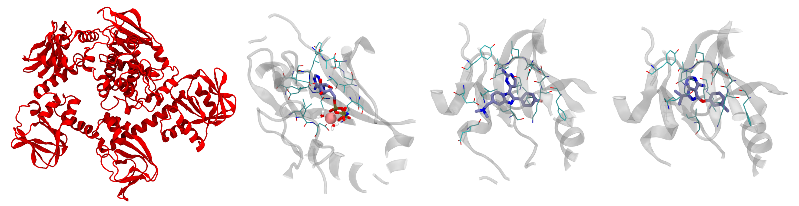

# Hands-on session: APO-HOLO systems for malaria targeting
## Introduction and context
This documents will provide a brief overview of the APO (without ligand) and HOLO (with ligand) protein kinase G systems that is given as exercise for the exam and how to set up the simulation box to get the simulations running.

Protein kinase G (PKG) is a key regulatory enzyme found in the malaria parasite Plasmodium. In Plasmodium falciparum, the species responsible for the most severe form of malaria in humans, PKG plays a critical role in various stages of the parasite's lifecycle, including its development within the mosquito vector and its replication within the human host's red blood cells. PKG is involved in signalling pathways that regulate essential processes such as parasite invasion of host cells, egress from infected cells, and differentiation into sexual forms for transmission to mosquitoes. Additionally, PKG has been identified as a potential target for antimalarial drug development due to its essential role in parasite survival and its divergence from human homologs, making it an attractive candidate for selective inhibition. The corresponding UNIPROT is [A5K0N4](https://www.uniprot.org/uniprotkb/A5K0N4/entry). The PDB IDs are [5DYL](https://www.rcsb.org/structure/5DYL) for the APO form, [5DZC](https://www.rcsb.org/structure/5DZC) for the HOLO form bound to a nonhydrolyzable analog of adenosine triphosphate (called ANP in the simulation box), [5F0A](https://www.rcsb.org/structure/5F0A) for the HOLO form bound to an inhibitor (called 1FB in the simulation box), and [5FET](https://www.rcsb.org/structure/5FET) for the HOLO form bound to another inhibitor (called 1TR in the simulation box).

The exact role of these molecules when targeting PKG is not strictly relevant for this tutorial. If you are interested you can read the corresponding publication[^1] from which the APO and HOLO + ANP structures were taken, while the other two come from results still under peer revision and, therefore, unpublished. Each excercise directory contains two subdirectories, one with the APO form (which is the same for all exercises) and one with one of the three ligand-bound structures linked above. These are not membrane proteins, and as such they can be simulated in a box of pure water, analogously to what done during the Lysozyme tutorial.

The individual directories of the different protein/ligand systems are organised as in the following
```
PKG_APO/HOLO_X_excercise
│   ionize.mdp
│   reference_topology_PKG_XXX.gro
│   reference_topology_PKG_XXX.top
│   sbatch_me.sh
│
└─── forcefield
│   │   [various forcefields files]
│
└─── solution_files
│   │   [the solutions of the excercise]
│
└─── step1_em
│   │   em.mdp
│
└─── step2_nvt
│   │   [various nvt.mdp files]
│
└─── step3_npt
│   │   [various npt.mdp files]
│
└─── step4_prod
    │   prod.mdp
```
Going by order, you can see
- The `ionize.mdp`, `reference_topology_PKG_XXX.gro`, and `reference_topology_PKG_XXX.top` files. These are the building blocks to set up your starting configuration. These will be covered in depth later in the tutorial.
- A `sbatch_me.sh` file. This is a text file that contains the set of instructions that will run your starting configuration through energy minimisation, NVT, NPT, and eventually the production phase.
- A `forcefield` directory. Inside this, you can find several text files that define 'numerically' the key components of your system. You might recognise some of them, like `PKG.itp`, the water model `tip3.itp`, and the ligands `1FB.itp`, `1TR.itp`, and `ANP.itp`. You can peek inside them and take a look at how a molecule is described numerically in MD simulations. The format of these files - that is, how these numbers are organised and reported - depends on the software you are using. Since in this course you use GROMACS, these files are written in GROMACS format. However, while these numbers and these files might be different for other software, the core idea of numerically representating with specific functions the intra- and inter-molecular interactions is paramount in molecular dynamics.
- A `solutions_files` directory. Here there are the `start.gro` and `topol.top` files that you should obtain at the end of this tutorial. If you want to run the simulations instantly, then move the files from this directory directly to `PKG_APO/HOLO_X_excercise` and go at the last sections of this tutorial about running the simulation.
- The `step1_em`, `step2_nvt`, and `step3_npt` directories. Inside each of these you can find one or more `mdp` (molecular dynamics parameters) files that will be used to compile and run the energy minimization, the NVT, and the NPT equilibrations. These will be run sequentially by the script `sbatch_me.sh`, taking your starting configuration through a set of equilibration phases to relax the starting configuration gradually and avoid the system exploding.
- The `step4_prod` directory. Here there is the `prod.mdp` file, which is the final mdp file for the production run of the system. This is usually the longest part of the simulation, which can take 3 to 5 days on Baobab depending on the system. The final output files of the simulation will be inside this directory, and the analysis for the exam will mainly revolve around the `prod.xtc` trajectory file.

## A look into the starting files and the general aim of this guide

The idea of this tutorial is to give you the main ingredients to build your own solvated simulation box without going through the hassle of finding a good target to simulate, fix the experimental structure files, find a consistent force field to describe the system, and embedding the protein in the membrane. Considering this, inside the main directory you can find a copy of three files which will be the basic blocks to build the system, namely
- `ionize.mdp`, the mdp file to add the ions in the system;
- `reference_topology_PKG_XXX.gro`, the starting structure that contains the structure of PKG in its APO form or in its HOLO form alongside the corresponding docked ligand;
- `reference_topology_PKG_XXX.top`, the starting topology of the system.

From these, and by using as reference the [Lysozyme in water](http://www.mdtutorials.com/gmx/lysozyme/) tutorial for solvation and ion addition, you should be able to obtain two files, the starting configuration of the solvated protein, which you will call `start.gro`, and the updated topology of the system, which you will call `topol.top`. These files will be then picked up by the `sbatch_me.sh` script and used as starting point to run the equilibration and the production runs of the system.

In the following, the tutorial shows the set-up of the simulation box by using as example the HOLO+ANP structure. Nevertheless, the logic of the procedure is identical and can be applied directly to all the other configurations as well.

## Building the starting box
First of all, send the directory with the exercises to your home in Baobab (with `scp`) and login into Baobab. Then, request a node for a couple of hours with `salloc` in the following way
```
salloc --ntasks=1 --cpus-per-task=4 --partition=private-gervasio-cpu --time=120:00
```
Finally, source the GROMACS installation
```
module load GCC/11.3.0
module load OpenMPI/4.1.4
module load GROMACS/2023.1-CUDA-11.7.0
```
and verify that the sourcing went okay by typing
```
gmx --version
```
Notice how here you are requesting 4 CPUs but no GPU, differently from one of the first lectures (in fact, you are on `--partition=private-gervasio-cpu`). In this case, you are going to use the allocation on Baobab just to set up the box and not to run the simulation, so the GPU is not needed. Once the allocation has been granted to you, change directory and go into one of the two exam systems by using `cd`. Here, if you list what's inside (type `ls`), you should see the various `stepX_XXX` directories and the starting files.

You are now ready to assemble the starting configuration of your system. One last point before moving on. GROMACS has a lot (> 100) tools that are accessible by typing `gmx` followed by a keyword. In this tutorial you will use `solvate`, `grompp`, `genion`, and `make_ndx`. If you have any doubts remember that you can look online for the explanation of the tool and which flags are needed (`-f`, `-o`, `-s` etc.). For example, [this](https://manual.gromacs.org/current/onlinehelp/gmx-solvate.html) is the manual page of `gmx solvate`. All this information is also awailable on the spot if you type `-h` or `--h` (for *help*) after the tool's name, e.g., `gmx solvate --h`.

### Solvating and generating the box
At the beginning, you can take a look at the starting topology (`reference_topology_PKG_HOLO_ANP.top`) and the starting configuration to solvate (`reference_topology_PKG_HOLO_ANP.gro`). The topology reads like this
```
#include "./forcefield/forcefield.itp"
#include "./forcefield/PKG.itp"
#include "./forcefield/ANP.itp"
#include "./forcefield/tip3.itp"
#include "./forcefield/ions.itp"

[ system ]
PKG HOLO with ANP and MG

[ molecules ]
; Compound         #mols
PKG                    1
MG                     1
ANP                    1
SOL                    2
```
First of all, notice that there are lines starting with a semi-column `;`. These are **comments**, that is, lines that are not read by GROMACS. Comments are used to annotate the files and write down details that are helping you - the user - remember what you are doing, what is the meaning of some variables, etc. To all effects, these are equivalent to your notes on the border of a book or on a slide to write something that is worth remembering, e.g. some explanation of the professor. They are ignored by the software and should be informative for the person writing or for the person supposed to read the code. Feel free to write your own comments, if it helps you. Just remember to put a `;` at the beginning of each line that you do not want to be read by GROMACS (you can't forget, as if you do the GROMACS command will simply fail and complain about non-sensical lines).

Following up, the `#include` statements tell GROMACS where to find the elements of the force field. As can be seen, they are collected inside the `forcefield` directory and must appear with a specific order. First, the set of parameters defining the force field (`forcefield.itp`). Then, the definition of the individual molecules (`PKG.itp`, `ANP.itp`, etc.) that will populate you system. These do not have to appear in a specific order, however <ins>all</ins> the molecules that you intend to use <ins>must</ins> be defined here. Building the topology, that is, filling in this file, is roughly the equivalent of running `gmx pdb2gmx` on the pdb file of the protein, as you did in the Lysozyme tutorial. In this case the system is much more complex and the pdb needs further handling. Thus, it wouldn't be possible to do in one simple line within GROMACS, so the topology is already provided. After the `#include` statements, there is the `[ system ]` section, which is simply the name of the system. It is worth giving the system a meaningful name to help in recognising the systems in the future.

Finally, there is the `[ molecules ]` section. This is a very important section which must contain <ins>all</ins> the molecules of the system <ins>in the order in which they appear</ins>. Notice that, for the time being, the topology contains one protein (`PKG`), one magnesium ion (`MG`), one ligand (`ANP`), and two water molecules (`SOL`). This is unique for the HOLO system with ANP, because the ANP ligand is an adenosine triphosphate analogue which is coordinated to a magnesium ion together with two water molecules. This is important because the whole complex ANP + MG + 2 H<sub>2</sub>O is the correct physiological state of the HOLO state of this protein when bound to ANP. The ligand doesn't bind without the coordinating water molecules and magnesium ion. GROMACS doesn't know if a ligand necessitas a magnesium or other ions and water molecules in some given positions. Thus, they are part of the initial box **before** the solvation as they have been modelled already in the correct state. This is where the biological and chemical knowledge of the user is critical for building a physiologically correct system. Among the systems presented in this tutorial, ANP is the only ligand that necessitates other molecules to be modelled properly in its binding site. The topologies and starting structures of the other systems contain only the host protein PKG and a ligand (for the HOLO states) or the protein alone (for the APO case). The APO structure and the three ligands are shown in Figure 1.

|  |
|:--:|
| Figure 1 *From left to right: PKG in its APO form; binding site with ANP, the magnesium ion, and the two coordinating water molecules; binding site with 1FB; binding site with 1TR. The residues nearest to the ligands are represented as lines. Color legends: red (oxygen), blue (nitrogen), yellow (phosphorus), pink (magnesium). Carbons are colored in cyan for the protein and iceblue for the ligands. Hydrogen atoms are hidden exception made for the water molecules, where they are white.* |

Now, take a look at the starting configuration `reference_topology_PKG_HOLO_ANP.gro` by opening this file with a text reader. The `.gro` file has a fixed format, and it is better to not modify it by hand if you are not completely sure about what you are doing. The first lines look like this
```
PKG HOLO with ANP ligand
12908
    1ACE     H1    1  12.255   9.683   1.920
    1ACE    CH3    2  12.282   9.770   1.861
    1ACE     H2    3  12.301   9.855   1.927
    1ACE     H3    4  12.202   9.795   1.792
    1ACE      C    5  12.405   9.741   1.784
    1ACE      O    6  12.461   9.632   1.791
    2GLY      N    7  12.452   9.840   1.705
    2GLY      H    8  12.403   9.929   1.702
[...]
```
The file has a first line which contains the title of the box (`PKG HOLO with ANP ligand`), a second line which contains the number of the atoms in the box (`12908`), and then it contains in order all the atoms of the system. These are organised usually as nine columns. The first (here `1ACE`) is the specific number and name of the reidue - which in this case is the capped N-terminal of PKG. The second column contains the specific name of the atom, and usually the first letter indicates the element (here you have a hydrogen followed by a carbon, two hydrogen atoms, another carbon, and so on). The third is simply the number of the entry. It always starts with `1` and goes up to the number of elements in the box. Then, columns four to six contain the x, y, and z coordinates of that atom, while the columns seven to nine contain its velocity, reported by axial component. Here you can see how the velocities are not reported, and so you have only six columns. All atoms must always have a position, but might have zero or undefined velocity. This is the case now, as you are building the box from a static experimental image. One of the main roles of the equilibrations phase is this - to relax the starting positions and assign reasonable starting velocities to all the atoms.

At the other end of the file, the last lines look like this
```
[...]
  800ANP    HC812901   9.954  11.756   3.126
  800ANP   HN3B12902  10.448  11.664   2.794
  801SOL     OW12903  10.681  11.334   3.167
  801SOL    HW112904  10.690  11.235   3.182
  801SOL    HW212905  10.712  11.356   3.073
  802SOL     OW12906  10.542  11.544   3.341
  802SOL    HW112907  10.543  11.515   3.439
  802SOL    HW212908  10.540  11.644   3.339
   0.00000   0.00000   0.00000   0.00000   0.00000   0.00000   0.00000   0.00000   0.00000
```
The meaning of the columns is the same as before. The last molecules to appear are the two water molecules (and in fact, in the topology, they are reported last). The last line of a `.gro` file has, like the first two, a special meaning. It contains the coordinates of the box, that is, the length of the box along x, y, and z. Sometimes it can have more than three numbers for particular box shapes. You can see how this box is actually undefined - GROMACS keeps this line used, as it has a special role, but it is filled with zeros. You will need to define a box before solvating the system.

As in the Lysozyme tutorial, you can set up the box by using `gmx editconf`
```
gmx editconf -f reference_topology_PKG_HOLO_ANP.gro -o reference_topology_PKG_HOLO_ANP_boxed.gro -bt dodecahedron -c -d 1
```
Here you are starting from the reference structure (`-f reference_topology_PKG_HOLO_ANP.gro`) and asking GROMACS to position your protein in the centre (`-c`), build a dodecahedron box (`-bt dodecahedron`), and make sure that the protein is at least 1 nm distant (`-d 1`) from the box sides to avoid periodic boundary conditions (PBCs) artifacts. Please not that, exactly because of PBCs, there is not a real centre of the box, and positioning the protein in it with `-c` is mostly for representation purposes rather than real physics. 

Differently from the Lysozyme tutorial, here you are also specifying the geometry of the box. In terms of simulations results, the outcome should not depend on the dimension or shape of the simulation box, as long as it is large enough to accomodate the contents (the protein in this case) and avoid self-interaction between PBC images. So, why bother changing the shape or dimension? Why don't just make a huge cube? A hint should come from one of the last lines of the ouput of `gmx editconf`, which will look something like this
```
new box volume  :1496.67               (nm^3)
```
Try now to build the same system by specifying a cubic (`-bt cubic`) box, you will end up with something like this
```
new box volume  :2116.61               (nm^3)
```
This means that you will have a roughly ~40% larger box, and so more water to solvate, a higher number of molecules to simulate, and consequently much slower simulations. You can try to keep a cubic box and follow up with the solvation, so you can see how many more water molecules are added with respect to the dodecahedron case.

Before running `gmx solvate`, you have to know which water model you want to use. For this force field, as also reported in the `reference_topology_PKG_HOLO_ANP.top` file, the model is [TIP3P](https://en.wikipedia.org/wiki/Water_model) (you are importing the parameters with this line `#include "./forcefield/tip3.itp"`), a three-point water model. This means that each water molecule in your simulation will simply be represented with three sites: one oxygen atom and two hydrogen atoms. To access a three-points water model, the flag name for `gmx solvate` is `-cs spc216.gro`, the same as for the Lysozyme tutorial.

Thus, you can solvate the system with the following
```
gmx solvate -cp reference_topology_PKG_HOLO_ANP_boxed.gro -cs spc216.gro -o reference_topology_PKG_HOLO_ANP_solvated.gro
```
where you are asking to add water to the structure with `-cp reference_topology_PKG_HOLO_ANP_boxed.gro`, use as reference a three-points water model with `-cs spc216.gro`, add call the resulting output structure `-o reference_topology_PKG_HOLO_ANP_solvated.gro`. Some of you may notice that in the Lysozyme tutorial you also have to pass the topology of the system with the `-p` flag. This is not mandatory, and has the advantage that the updated topology would have the same name as the input one, which makes harder to trace back after possible errors. However, if you don't pass the topology then you will have to update it by hand to include the presence of the water molecules.

The (last lines of the) output of this command will look something like this
```
[...]
Volume                 :     1496.67 (nm^3)
Density                :     999.599 (g/l)
Number of solvent molecules:  44578 
```
GROMACS tries to fill the box with water to reach the density of ca. 1 g/L. The most important part here is the number of water molecules inserted, in this case `44578` (this number can oscillate slightly). You now has just to add this number at the end of the topopolgy to tell GROMACS that the content of the box has changed.

First, copy the reference topology and call it `reference_topology_PKG_HOLO_ANP_solvated.top` with the `cp` (copy) command
```
cp reference_topology_PKG_HOLO_ANP.top reference_topology_PKG_HOLO_ANP_solvated.top
```
Then, add the amount of water molecules to `reference_topology_PKG_HOLO_ANP_solvated.top` by correcting the `[ molecules ]` section in the following way
```
[...]
[ molecules ]
; Compound         #mols
PKG                    1
MG                     1
ANP                    1
SOL                44580
```
You have to add the name of the water in the box (`SOL`) and the number reported after tunning `gmx solvate`. For the HOLO + ANP structure, `SOL` was already reported as there are two water molecules coordinating the MG ion, and as such you just have to add two to the total solvation number. For the other structures, just report the plain number obtained from the output of `gmx solvate`.

At this point, the structure of the solvated system is contained in `reference_topology_PKG_HOLO_ANP_solvated.gro`, while its topology in `reference_topology_PKG_HOLO_ANP_solvated.top`.

### Adding ions
You are now ready to add the ions in the system. First, you need to generate a `.tpr` file, which is a binary file that GROMACS can read to understand the charges of the different molecules in the system and select automatically how many ions should be added. You can do this by using `gmx grompp` and pointing to the parameters file `ionize.mdp` with the flag `-f`, to the starting solvated structure `reference_topology_PKG_HOLO_ANP_solvated.gro` with the flag `-c`, to the solvated topology `reference_topology_PKG_HOLO_ANP_solvated.top` with the flag `-p`, and finally name the output tpr file `ionize.tpr` with the flag `-o`
```
gmx grompp -f ionize.mdp -c reference_topology_PKG_HOLO_ANP_solvated.gro -p reference_topology_PKG_HOLO_ANP_solvated.top -o ionize.tpr
```
For some systems this command will fail with a fatal error. If you look at the error, you can see a section with the following information
```
NOTE 2 [file reference_topology_PKG_HOLO_ANP_solvated.top, line 15]:
  System has non-zero total charge: -3.000000
  Total charge should normally be an integer. See
  http://www.gromacs.org/Documentation/Floating_Point_Arithmetic
  for discussion on how close it should be to an integer.

WARNING 1 [file reference_topology_PKG_HOLO_ANP_solvated.top, line 15]:
  You are using Ewald electrostatics in a system with net charge. This can
  lead to severe artifacts, such as ions moving into regions with low
  dielectric, due to the uniform background charge. We suggest to
  neutralize your system with counter ions, possibly in combination with a
  physiological salt concentration.
```
Basically, a tpr file is used to run simulations. As such, when GROMACS tries to prepare one through `gmx grompp`, it check if the physics of the system is reasonable or not. In this case, it found that your system has a net charge of -3, and is telling you that this is very bad as the systems should always have zero total net charge. You can bypass this check by adding the flag `--maxwarn 1` to the command, that is, ignore one (and only one) warning
```
gmx grompp -f ionize.mdp -c reference_topology_PKG_HOLO_ANP_solvated.gro -p reference_topology_PKG_HOLO_ANP_solvated.top -o ionize.tpr --maxwarn 1
```
You will see that now GROMACS still complains, but gets the job done. It is very important, however, to understand that the ionization step is nearly the **only** case in which it is okay to use the `--maxwarn` flag, as you **know** that the physics of the system is wrong and you actually need the tpr to fix it with `gmx genion`. In general, you should **never** use this flag. If there is a major warning and a GROMACS command fails, then you have to check why and fix the problem. You may be tempted to use `--maxwarn` to get through errors you do not understand, and the flag will let you do it. Nevertheless, the simulatiom will probably fail istantly the moment you try to run it, and, if not, you are likely to produce garbage results due to overlooking fundamental physics mistakes in the box preparation.

Now, you should have a `ionize.tpr` file in your directory, following the `gmx grompp` command. You are ready to insert the ions with the following command
```
gmx genion -s ionize.tpr -neutral -pname NA -nname CL -o start.gro
```
Here, you are asking GROMACS to make the system neutral (`-neutral`), call the positive ions `NA`, the negative ions `CL`, and call the resulting output `start.gro`. Trivially, within this force field the atoms NA and CL refer to sodium (Na, +1) and chlorine (Cl, -1) ions. Again, differently from the Lysozyme tutorial, you are not giving as input the topology and you will update it after the addition of ions. With `gmx genion`, GROMACS tries to substitute some molecules in the system with the necessary number of ions. You will be promted by GROMACS to choose which part of the system you are okay to substitute in favour of water molecules
```
Will try to add 3 NA ions and 0 CL ions.
Select a continuous group of solvent molecules
Group     0 (         System) has 146642 elements
Group     1 (        Protein) has 12857 elements
Group     2 (      Protein-H) has  6392 elements
Group     3 (        C-alpha) has   797 elements
Group     4 (       Backbone) has  2392 elements
Group     5 (      MainChain) has  3191 elements
Group     6 (   MainChain+Cb) has  3933 elements
Group     7 (    MainChain+H) has  3973 elements
Group     8 (      SideChain) has  8884 elements
Group     9 (    SideChain-H) has  3201 elements
Group    10 (    Prot-Masses) has 12857 elements
Group    11 (    non-Protein) has 133785 elements
Group    12 (            Ion) has     1 elements
Group    13 (          Other) has    44 elements
Group    14 (             MG) has     1 elements
Group    15 (            ANP) has    44 elements
Group    16 (          Water) has 133740 elements
Group    17 (            SOL) has 133740 elements
Group    18 (      non-Water) has 12902 elements
Group    19 ( Water_and_ions) has 133741 elements
Select a group: 
```
From the first line you can see that GROMACS understood that the system has a total of -3 charge and will then need three positive ions to have a total of zero net charge. Since you do not want to substitute any part of the protein or the ligand with ions, choose the `SOL` group, the number 17, and GROMACS will randomly choose seven water molecules, remove them and place there a sodium ion.
```
Select a group: 17
Selected 17: 'SOL'
Number of (3-atomic) solvent molecules: 44580
Using random seed -17319946.
Replacing solvent molecule 3201 (atom 22505) with NA
Replacing solvent molecule 2493 (atom 20381) with NA
Replacing solvent molecule 18348 (atom 67946) with NA
```
As for the solvation, you need now to update the topology as some water molecules have been removed and some sodium ions have been added. Start by copying the solvated topology into a new topology called `topol.top`
```
cp reference_topology_PKG_HOLO_ANP_solvated.top topol.top
```
and change the `[ molecules ]` section by removing the three water molecules from the total and adding the three sodium ions (`NA`)
```
[...]
[ molecules ]
; Compound         #mols
PKG                    1
MG                     1
ANP                    1
SOL                44577
NA                     3
```

If the `gmx grompp` command didn't fail, it is because the system has already total charge equal zero. Thus, when you run the `gmx genion -s ionize.tpr -neutral -pname NA -nname CL -o start.gro`, GROMACS will not prompt you to ask which part of the system you want to substitute in favour of ions, as there are no ions to add, and the output will look like this
```
No ions to add, will just copy input configuration.
```
Basically, you have copied the configuration stored in `ionize.tpr`, which is the one in `reference_topology_PKG_HOLO_ANP_solvated.gro`, and called it `start.gro`. You should now copy the topology and call it `topol.top`, but you do not have to update it as no water molecules have been removed and no ions have been added, and you are good to go.

Summarising, you now have the starting solvated and neutralised configuration stored in `start.gro` and the corresponding topology in `topol.top`. You can take a look at the final system with VMD. It should look similar to that shown in Figure 2.

|  |
|:--:|
| Figure 2 *Final solvated dodecahedron box for the PKG+ANP HOLO system. Water is represented as a transparent white surface. PKG is in a red cartoon representation. ANP is represented as sticks. Ions are represented with their van der Waals radii and are in blue (sodium) and pink (magnesium). Water is reported as a transparent white surface. The chlorine ions are shown as yellow spheres based on their van der Waals radii. Remember that all the atoms in the system are actually points without a radius described by a set of coordinates, they are not spheres. However, you can use their van der Waals radii to estimate how 'large' the atoms are, that is, how much space around them is physically precluded to other atoms due to the atomic repulsion of the inter-molecular van der Waals forces.* |

## Run the simulation
### A look at the `sbatch_me.sh` file
Whether you completed the tutorial or you moved the corresponding files from the `solution_files` directory, now the content of the excercise directory should be similar to this
```
PKG_APO/HOLO_X_excercise
│   sbatch_me.sh
│   start.gro
│   topol.top
│
└─── forcefield
│
└─── step1_em
│   │   em.mdp
│
└─── step2_nvt
│   │   [various nvt.mdp files]
│
└─── step3_npt
│   │   [various npt.mdp files]
│
└─── step4_prod
    │   prod.mdp
```
plus the `solution_files` directory and some leftover files from the system generation. It is mandatory that `sbatch_me.sh`, `start.gro`, and `topol.top` are together in the same directory in which there are the energy minimization, NVT, NPT, and production directories, otherwise the script `sbatch_me.sh` won't be able to run the simulations for you.

During both the Lysozyme tutorial and the preparation of the box for this excercise, you logged in a Baobab node by using the `salloc` command. In this way you can have access to a node and run an interactive job. This is nice because you can have real time answers from the node and you see clearly what is going on and what you are doing, which is pivotal for error-prone procedures like the generation of the starting box. However, when you close the connection, log out from Baobab, or simply turn off the computer, you lose the access to the computer and any running simulation will stop. Does this mean that you should be always connected? And that you should stay constantly in front of your computer, even for a few days at a time, while the simulations run, scared or losing the internet connection and see your runs fail?

Clearly this is not the case. As explained also in the [first part](https://github.com/obzehn/GROMACS_hands-on_intro/tree/main?tab=readme-ov-file#allocating-an-interactive-job) of this github, Baobab has a so-called queueing system, named [slurm](https://slurm.schedmd.com/overview.html). With slurm, you can prepare a *submission script* which contains the main commands that you want to run alongside the resources that you need. This is exactly what the `sbatch_me.sh` script is.

You can look at the content of the `sbatch_me.sh` with a text editor. The first lines look like this
```
#!/bin/bash 

#SBATCH --account=gervasio_teach_19h330
#SBATCH --partition=private-gervasio-gpu
#SBATCH --time 144:00:00
#SBATCH --job-name PKG_ANP
#SBATCH --error jobname-error.e%j
#SBATCH --output jobname-out.o%j
#SBATCH --ntasks 1
#SBATCH --cpus-per-task 16
#SBATCH --nodes 1
#SBATCH --gpus-per-node=nvidia_geforce_rtx_3080:1
#SBATCH --hint=nomultithread

[...]
```
You can recognise some of the flags that you were giving to the `salloc` command, such as `--partition=private-gervasio-gpu` and `--cpus-per-task 16`. Basically these lines are specifying which kind of hardware you need to run the simulations. If you are curious, you can loook up their meaning in the slurm website.

Slurm reads this files and sends you in a queue while it waits to find some computer that is available and that has the requested hardware. When it finds it, it takes control of it for the amount of time specified in `--time 144:00:00`, that is, six days. This amount of time will be sufficient to both conclude the equilibration and the production runs. As in the interactive case, the first thing to do once the node is allocated is to source GROMACS, which is the first thing done by the script with the lines following the `#SBATCH` node requests, i.e., with the following
```
[...]
module load GCC/11.3.0
module load OpenMPI/4.1.4
module load CUDA/11.7.0
module load GROMACS/2023.1-CUDA-11.7.0
[...]
```
Then there are a few technical details about how GROMACS should use the available resources to run the simulations with `gmx mdrun` (e.g. `-ntmpi`, `-ntomp`, etc.).

Lastly, there are a series of commands that enter with `cd` the `step1_em`, `step2_nvt`, `step3_npt`, and `step4_prod` directories and systematically run `gmx grompp` to prepare the corresponding tpr files and then run them with `gmx mdrun`.

You can send the submission script `sbatch_me.sh` and let slurm handle the simulations by using the [sbatch](https://slurm.schedmd.com/sbatch.html) command. This command should be run from Baobab's headnode, and not from the node that you received by running `salloc`. Thus, if your command line still looks like this
```
(baobab)-[username@cpuxxx some_directory_name] $
```
type `exit` to exit the node. Once the terminal looks like this
```
(baobab)-[username@login1 some_directory_name]$
```
e.g., your `username` is logged in on `login1`, the headnode of Baobab, and not on some `cpuxxx` or `gpuxxx` node, you are good to go. From the `PKG_APO/HOLO_X_excercise` directory, that is, where the submission script `sbatch_me.sh` is located, you can submit `sbatch_me.sh` to slurm with the following command
```
sbatch sbatch_me.sh
```
If the command runs successfully, slurm returns the number that is assigned to your job, something like this
```
Submitted batch job 16568567
```
You can check the status of the job by running (and substituting `username` with yours)
```
squeue -u username
```
The output will look something like this
```
             JOBID PARTITION     NAME     USER ST       TIME  NODES NODELIST(REASON)
          16568567 private-g    PKG_ANP username  R       2:11      1 gpu039
```
The `R` under the column `ST` (for *status*) stands for *running*. Usually, the job stays in the queue with some other status, like `PD`, before changing to `R`. Once it's running, you will see that slurm directly writes the output to the excercise directories, e.g., you will see `em.gro`, `em.trr`, and other output files appearing in `step1_em`, `nvt_1.log`, `nvt_1.gro` etc. in `step2_nvt`, and so on. Now that the job is submitted and running, you can log out from Baobab without risking to stop it. For the malaria target exercises, the time needed to complete the whole equilibration phase (steps 1 to 3) is of about two hours, while to complete the production it will take roughly two days, so a total of two days overall.

### A look at the process of equilibration
Differently from the Lysozyme tutorial, here you can see that the NVT and NPT simulations are not unique, but they consist of several steps each, which are run one after the other. For the sake of completeness, you can take a look at the various `nvt_X.mdp` and `npt_X.mdp` files. As for the other files, the lines starting with `;` are comments, that is, they are ignored by GROMACS and are usuful only for human readers to organize the code.

Let's take a look at a few key entries in the mdp file.
```
[...]
;---------------------------------------------
; INTEGRATOR AND TIME
;---------------------------------------------
integrator               = md
dt                       = 0.002
nsteps                   = 50000
[...]
```
Here you are asking GROMACS to use a [leapfrog integrator](https://en.wikipedia.org/wiki/Leapfrog_integration) by setting `integrator = md`. The integration is performed with a time step `dt` of 0.002 ps, that is, 2 fs, which is the standard for this type of simulations. Lastly, the integration is performed for 50000 steps, as set by `nsteps`, that is, `50000 x 0.002 ps = 100ps`. You can see that the number of steps is relatively short with respect to the production run, as reported in the `prod.mdp` parameters file.

The other most important section is the one where you set the thermostat and barostat settings. For the NVT runs, you have the thermostat that controls the temperature and the parameters look something like this (here taken from `nvt_6.mdp`)
```
[...]
;----------------------------------------------
; THERMOSTAT AND BAROSTAT
;----------------------------------------------
; >> Temperature
tcoupl                   = v-rescale
tc-grps                  = Protein non-Protein
tau_t                    = 0.5     0.5
ref_t                    = 300     300
; >>  Pressure
pcoupl                   = no
[...]
```
The thermostat is connected separately to the two phases of your system. As for the GPCRs systems, the components in the box are coupled separately to the thermostat to achieve better thermostatting (as specified by `tc-grps`). However, differently from the GPCRs, you didn't have to produce an index file here because the names you are using for the groups are standard ones that are automatically recognised by GROMACS. Notice how there is no pressure coupling (`pcouple = no`). For the NPT runs, instead, the barostat is activated and the box can oscillate and change its volume. You can see the parameters of the barostat in the `THERMOSTAT AND BAROSTAT` sections for any of the `npt_X.mdp` file.
```
[...]
; >>  Pressure
pcoupl                   = C-rescale
pcoupltype               = isotropic
tau-p                    = 1.0
compressibility          = 4.5e-5
ref-p                    = 1.0
[...]
```
The reason why there are several NVT and NPT sub-phases is that the system should be relaxed gradually, otherwise it might distort the starting configuration, which would be detrimental - if not deadly - for maintaining the correct binding pose of the ligand. This can be achieved by putting so-called *restraints* on specific atoms of the system to restrain them in space, that is, to not let them move too much. This behaviour is controlled by the parameters defined under the `POSITION RESTRAINTS` section, as in the following example taken from `nvt_1.mdp`
```
[...]
;---------------------------------------------
; POSITION RESTRAINTS
;---------------------------------------------
define                    = -DPOSRES_PRO -DPOSRES_FC_SC=500 -DPOSRES_FC_BB=1000 -DPOSRES_IONS -DPOSRES_MG=1000 -DPOSRES_LIG=1000
[...]
```
The technical implementation and the specific meaning of these parameters is beyond the scope of this tutorial. The take at home message is that, due to the restraints, at the beginning both the ligand and the protein (and the MG ion for the ANP system) can't really move freely in space, but water can. In this way you can thermalize first the water molecules. Then, gradually, the restraints on the atoms of the system are decreased to let the whole system equilibrate. You can check the values of the parameters in the `POSITION RESTRAINTS` of the `nvt_X.mdp` and `npt_X.mdp` files. You will see that they gradually decrease up to disappearing in the last NPT equilibration. You can also see that the `nvt_X.mdp` files actually have an increasing temperature, so that the system is thermalized gradually to avoid distorsions of the experimentally-resolved binding site.

The production run is usually simulated without restraints at all, and in fact there is no restraint defined in `prod.mdp`, as you would like to simulate the 'natural' behaviour of the system. In this tutorial, the [statistical ensemble](https://en.wikipedia.org/wiki/Ensemble_(mathematical_physics)) of the production run is still the isothermal-isobaric ensemble (NPT), as you can see from the `prod.mdp` file since both the thermostat and the barostat are active. It is informally called *production* because it is the part of the simulation that is used most of the times for the analysis, as it comes after the equilibration and it is supposed to be well relaxed.

## Tips and tricks for trajectories handling
Trajectories are fidgety things. The standard format of the GROMACS trajectory, an `.xtc` file, contains the positions of the atoms as a function of time, collected as a sequence of frames. The frequency of the output is set by the keyword `nstxout-compressed` in the mdp files, in units of time steps. For the protein/ligand productions, this is 10000, that is, `10000 x 0.002 ps = 20 ps`. Considering that the run is long 250 ns, this means that you will collect 12500 frames. The content of the frames is defined by the keyword `compressed-x-grps`. Since this was not set in the mdp files, the default is the whole system, that is, the protein and, if present, ligands and ions. You can imagine how writing coordinates for hundreds of thousands of atoms for thousands of frames can be very memory intesive. Deciding in advance what to print and the frequency is very important, and can save you a lot of space. However, it is better to stay on the safer side as the only way to recover not printed data is to rerun the simulation.

This short section covers a couple of key points in handling trajectories and the representation of periodic boundary conditions. It is important to understand that the information of the trajectory is the same, and changing its representation *doesn't change the content*. There are a few reasons why post-processing of the trajectory is fundamental. The most important is for analysis purposes, as some tools might be sensible to the representation of the molecules. For example, RMSD calculation might break down and give non-sensical jumps if the tool that calculates it doesn't reconstruct the trajectory by fixing broken molecules across boundaries. Building on this point, very large trajectories are also hard to handle from the hardware perspective, and it is better to reduce them to the strictly necessary so that tools analysing them are faster. Hanling trajectories is important also for representation purposes, e.g., rendering a fancy image for a publication. Moreover, this is connected to understanding via visualization, as watching the trajectory is very important to gain insights on the system and check possible criticalities, and human eyes work better with whole molecules.

The main tool for trajectory handling in GROMACS is [`gmx trjconv`](https://manual.gromacs.org/current/onlinehelp/gmx-trjconv.html). Take a look at the manual for the optional flags and see if anything fits what you want to do (or check with `gmx trjconv --h`). This is a tool that notoriusly necessitates of some experience to achieve an efficient usage, but it is worth pointing out a few key commands. Generally, after running `gmx trjconv` GROMACS asks some further information (depending on the flags you are using) in terms of contents of the system. The most important thing here is to read properly what GROMACS asks and answer accordingly to your own purpose.

Figure 4 shows a few ways in which the trajectory can be post-processed. The videos were rendered with VMD. They are discussed in the following in a left-to-right order
**TO BE ADDED SOON**

## References
[^1]: El Bakkouri, M., et al. "Structures of the cGMP-dependent protein kinase in malaria parasites reveal a unique structural relay mechanism for activation." Proceedings of the National Academy of Sciences 116.28 (2019): 14164-14173. [DOI:10.1073/pnas.190555811](https://doi.org/10.1073/pnas.190555811)
