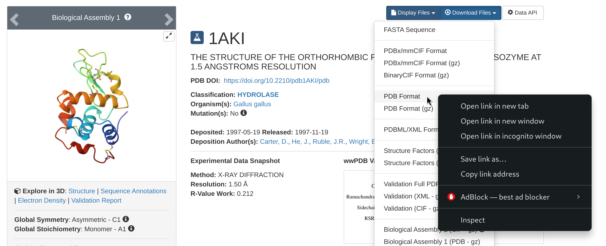

# GROMACS and Baobab hands-on introduction
## A cheat sheet for running GROMACS on Baobab
This page is a simple summary of a few key commands to run molecular dynamics (MD) simulations with [GROMACS](https://www.gromacs.org/) on [Baobab](https://doc.eresearch.unige.ch/hpc/start), a high performance computer at the University of Geneva. It has been written as a support for the hands-on session within the *Advanced course modeling*, which focuses on the [*Lysozyme in water*](http://www.mdtutorials.com/gmx/lysozyme/) tutorial. Nevertheless, the general concepts about allocating and running jobs can be directly applied to run other MD simulations on Baobab, such as those presented in the excellent [suite of tutorials](http://www.mdtutorials.com/gmx/index.html) from which the one presented in this lecture is taken. Some of the key words presented here are highlighted in red and are hyperlink to web pages that describe in depth some of the fundamental concepts in GROMACS and, more generally, in the high performance computing field.

## Allocating an interactive job
On [high-performance computing (HPC)](https://en.wikipedia.org/wiki/High-performance_computing) systems, such as Baobab, the jobs submitted by the users are handled by a so-called queueing system, which ensures that every job has the necessary resources and regulates the users queue. Baobab’s queueing system is [slurm](https://slurm.schedmd.com/overview.html), which permits both interactive and non-interactive sessions. Most of the times MD simulations do not necessitate any interactivity. In these cases jobs are submitted by providing a *submission script* to Slurm via the [`sbatch`](https://slurm.schedmd.com/sbatch.html) command. The queueing system will then queue the job and run it as soon as the requested resources are available. However, given that the meaning of this lecture is to go through the pipeline of setting up and running a MD simulation, in our case the jobs will be interactive. This means that Slurm will find the resources requested by the job, allocate them, and log you in on the corresponding *node*, that is, a computer that has the hardware specs that you requested. As such, if you quit the interactive session, e.g. by logging off the allocated node and going back to the head node or by closing the ssh session, you will have to allocate and queue again to reopen the interactive session.

First of all, you need to [`ssh`](https://man.openbsd.org/ssh) to Baobab via the following command (substitute `username` with your username)
```
ssh username@login2.baobab.hpc.unige.ch
```
Insert your password. You should now be logged in on Baobab, which is confirmed by the beginning of your terminal line that will look something like this
```
(baobab)-[username@login2 ~]$}
```
Now you can allocate an interactive job via Slurm by running the following command
```
salloc --ntasks=1 --cpus-per-task=8 --gpus=1 --partition=private-gervasio-gpu,shared-gpu --time=180:00
```
The flags specify what type of resources you need. There are [many flags](https://slurm.schedmd.com/salloc.html) available in Slurm to describe your necessities and allocate the correct amount of resources for your job. In our case these are
* **--ntasks=1** sets the number of [tasks](https://simple.wikipedia.org/wiki/Task_(computers))
* **--cpus-per-task=8** sets the number of [CPUs](https://en.wikipedia.org/wiki/Central_processing_unit) per task
* **--gpus=1** sets the number of [GPUs](https://en.wikipedia.org/wiki/Graphics_processing_unit)
* **--partition=private-gervasio-gpu** sets the partition that has to be used, e.g. the name of the domain where to look for resources
* **--time=180:00** sets the time allocated for the job (three hours)

Slurm will then queue your request. Depending on the queuing situation and on the requested resources, the job should ideally start within a few seconds. You will notice that Slurm changes your location from the head node (`login2`) of the cluster to the allocated GPU node, switch that you can also notice by the change in the terminal line header that now reads as
```
(baobab)-[username@gpuxxx ~]$
```
where `xxx` is a number indicating in which GPU node you are logged in.

## Loading GROMACS
At this point you are logged in and the GPU node is available to you for the time specified in the previous command or up to when you log out of it. However, the nodes are virgin of any software, as having all of them always available would be useless and impossible to maintain properly. This means that you have to request specifically what type of software you need, which will also depend on the type of node you have allocated. For example, if you want to use software based on GPU acceleration, as with GROMACS in our case, you have to request a node that has GPUs available (we did it with the `--gpus=1` flag). Moreover, if the software has some dependencies, i.e., it relies on other software to work properly, then you have to load those dependencies first. Again, this is the case of GROMACS, which depends on other software to exploit the hardware available on HPC clusters.

Unfortunately, both software and hardware have been growing in complexity over the years, and the zoo of interactions and dependencies has consequently exploded. For the sake of curiosity, you can simply take a look at the [plethora of options](https://manual.gromacs.org/documentation/current/install-guide/index.html) available for the installation of GROMACS. Things get even more complicated when working on HPC clusters, since some of these options are architecture dependent, i.e., they can work on some nodes but not on others, and seldom cannot be solved by “normal” users like us that lack the permissions to modify core functionalities of the cluster itself. The installation of GROMACS – and of its corollary software – is way beyond the scope of this lecture, but it is worth taking a look at the complexity of these structures to better appreciate *why* the usage of high throughput scientific software is far from trivial.

Fortunately for you, a GROMACS installation for today’s tutorial is already available. Thus, it is sufficient to `source` it, that is, to tell to the terminal where GROMACS files are located. Very roughly speaking, this means that you load on your terminal the command keywords that refer to the software you need (if you are curious, just type `gmx_mpi --version` on your terminal – what answer do you get?). However, as just introduced, we have to firstly load GROMACS dependencies beforehand, which in our case means executing these following commands one after the other
```
module load GCC/12.2.0
module load OpenMPI
module load CUDA/12.0.0
module load Python
source /srv/beegfs/scratch/shares/flg/programs/plumed2-master_libtorch1.8_0523/libtorch/sourceme.sh
source /srv/beegfs/scratch/shares/flg/programs/plumed2-master_libtorch1.8_0523/sourceme.sh
source /srv/beegfs/scratch/shares/flg/programs/gromacs-2023/install_mpi_0523/bin/GMXRC
```
In case the directory of Professor Gervasio’s group is not accessible for whatever reason, you can rely on those already installed in Baobab, which you can source with the following commands
```
module load GCC/11.3.0
module load OpenMPI/4.1.4
module load CUDA/11.7.0
module load GROMACS/2023.1-CUDA-11.7.0
```

The `module load` commands load specific packages that were used for GROMACS installation, and that are needed for running it properly. The first four lines load [GCC](https://gcc.gnu.org/), a C/C++ compiler (among others), [OpenMPI](https://www.open-mpi.org/), a parallelization interface that permits to run parallel jobs on several threads and/or nodes, [CUDA](https://developer.nvidia.com/cuda-toolkit), a library to exploit GPU acceleration, and finally [Python](https://www.python.org/), a widely used programming language. Then, we source [PLUMED](https://www.plumed.org/), an additional suite of tools that add multiple options and functionalities to GROMACS, which in this specific installation requires also [PyTorch](https://pytorch.org/), a python library for machine learning. Finally, we source GROMACS. Notice how the first commands use module load, while the last ones use source. If the first set of commands doesn't work and you have to load `GROMACS/2023.1-CUDA-11.7.0` do not worry, for this course we won't need PLUMED/Pytorch.

You can verify that GROMACS has been correctly sourced by running again the following
```
gmx_mpi --version
```
You should get as an answer an outline of GROMACS installation. Again, this offers a quick glimpse of the number of links and dependencies that needs to be satisfied to make these software run smoothly and optimally.

## Running GROMACS and moving data
You are now logged in a GPU node and have a clean GROMACS installation sourced. In principle, you can follow the tutorial. There are, however, a couple of modifications to the commands presented in the tutorial to run simulations properly.

First and foremost, the tutorial’s base command to run GROMACS is `gmx`, which will not work in our case. This is because the GROMACS version sourced has been compiled with OpenMPI, the suite for software parallelization, which automatically appends the suffix `_mpi` to the commands. The workaround is to just substitute all `gmx` calls with `gmx_mpi` as you follow the tutorial. Leave the rest of the commands unmodified, and simulate happily. Secondly, you won’t have a proper graphic interface on the GPU node, that is, you will not have windows opening and the interactions are mainly mediated by the keyboard in the terminal rather than by clicking with the mouse on icons as in most of our daily experience of computers. As such, you will have to navigate between directories and move/copy files via the terminal. The first times it can be a bit overwhelming and may feel confusing, but don’t worry, you will get used to it very fast. Remember also that you have a terminal cheat sheet along with the other documents of this course to help you getting a grasp of the main commands needed, and that you can always ask us. Moreover, resources like [StackOverflow](https://stackoverflow.com/) contain a wealth of information and explanations, and it is more than likely that someone had your same problem beforehand. So, why do not take advantage and learn from those solutions?

This being said, it is worth pointing out a couple of commands that you might need to begin the tutorial. The first is [`wget`](https://ftp.gnu.org/old-gnu/Manuals/wget-1.8.1/html_mono/wget.html), and you will need it to download files from a web address. At the beginning of the tutorial, you will be asked to go to the [RCSB](https://www.rcsb.org/) website and download the protein data bank file `1AKI.pdb`. To do this, just follow the steps locally on your browser, but rather than downloading the file, right-click on the download option and copy the link address to that file.



Then, go back to your terminal and download the pdb file with the following
```
wget https://files.rcsb.org/download/1AKI.pdb
```
This will download the pdb file directly in the directory from where you are using the wget command. If for any reason you can’t find the link address, just copy it from this document.

Another important command is [`scp`](https://linux.die.net/man/1/scp), which you can use to move files from you computer to the cluster and vice-versa. This may come in hand if, for
example, you have prepared some input files on your personal machine and you want to move them on the cluster to run the simulations, or if you want to analyze locally on your laptop some of the results that you will obtain in today’s tutorial or in your future simulations.

To outline two simple examples, let’s suppose you are in Baobab and want to download a directory named `Results`. You will need the exact address of the directory to download it. You can get it by entering in the directory (with [`cd`](https://man7.org/linux/man-pages/man1/cd.1p.html)) and by typing `$PWD` or `pwd`, which will return the position you are in at that moment, e.g., something like this
```
-bash: /home/users/u/username/Results: Is a directory
```
Now, from *outside* Baobab (log off from Baobab or open another terminal session on your machine), you run the following command (after substituting your user’s details)
```
scp -r username@login2.baobab.hpc.unige.ch:/home/users/u/username/Results ./
```
This will download the directory `Results` in the directory from which you are launching the `scp` command. Vice-versa, let’s say you have your directory `Simulations` locally on your machine, then you can `cd` into the directory containing the directory `Simulations` and run the following
```
scp -r ./Simulations/ username@login2.baobab.hpc.unige.ch:/home/users/u/username/
```
This will upload `Results` to your home directory in Baobab.
